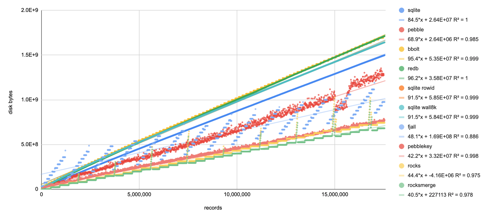
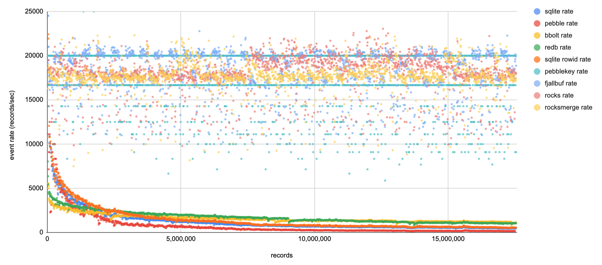
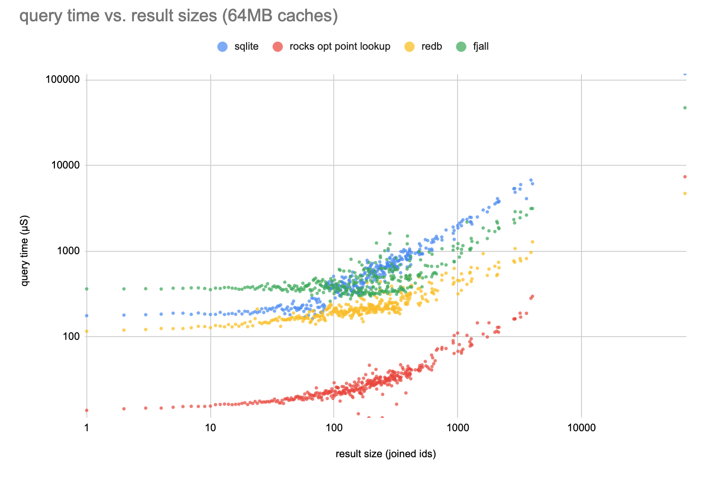

some kv stores

these benchmarks are not robust, please make your own measurements, probably use better methods, and don't claim i've shown anything.

### space efficiency

### write speed (extra sketchy)

LSMs are fast, wow. Btrees are pretty fast, but not fast enough for my needs: at least 3k entries / sec, aiming ideally for 9k, but no higher.

### read speed (super extra sketchy and unreliable)

This test is unfair for fjall becuase it was configured with a larger block size to try and speed up the writes. I should re-run it, but haven't gotten around to it yet.

Rocksdb is at its default of 4kb block size. Is that how it's fast?

I tried to configure the block caches for all DBs to 64MB but I might have done that wrong for rocks. Also I called `optimize for point reads` to start up rocks, which might do other unfair things.
