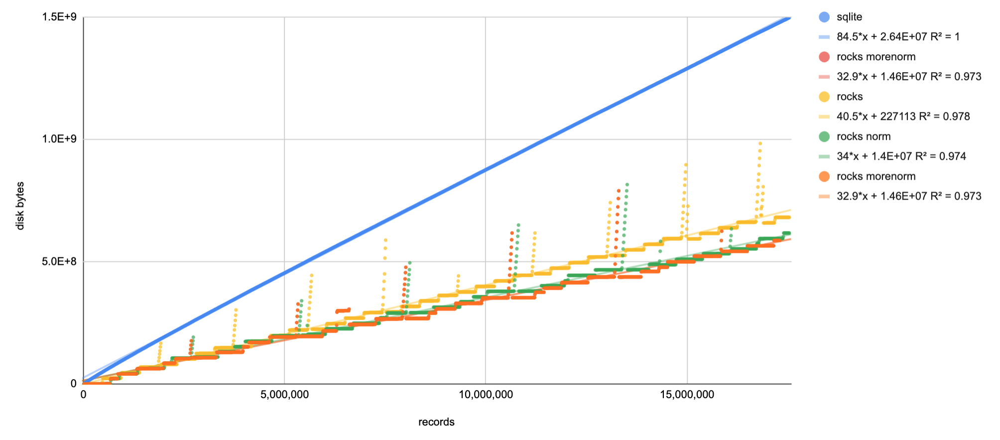
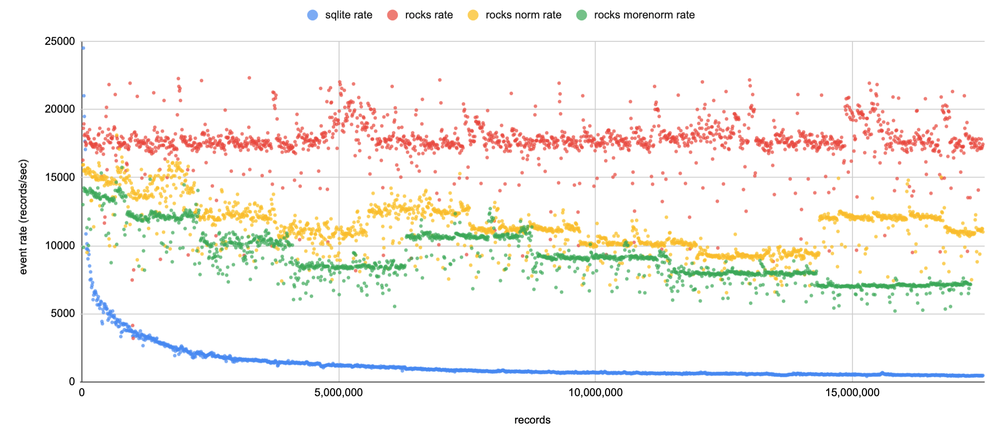

building on old sad macos:

```bash
nix-shell -p rocksdb
ROCKSDB_LIB_DIR=/nix/store/z2chn0hsik0clridr8mlprx1cngh1g3c-rocksdb-9.7.3/lib/ cargo build
```

(todo: get the lib dir better)

yay rocks is fast. can we increase space efficiency?




